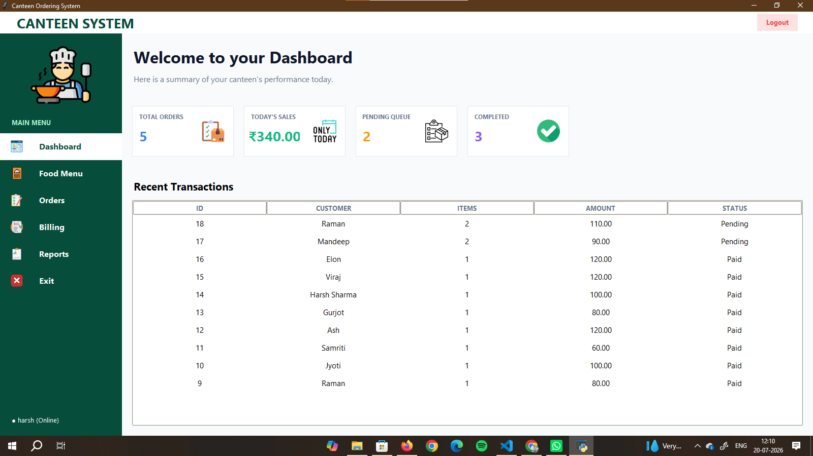
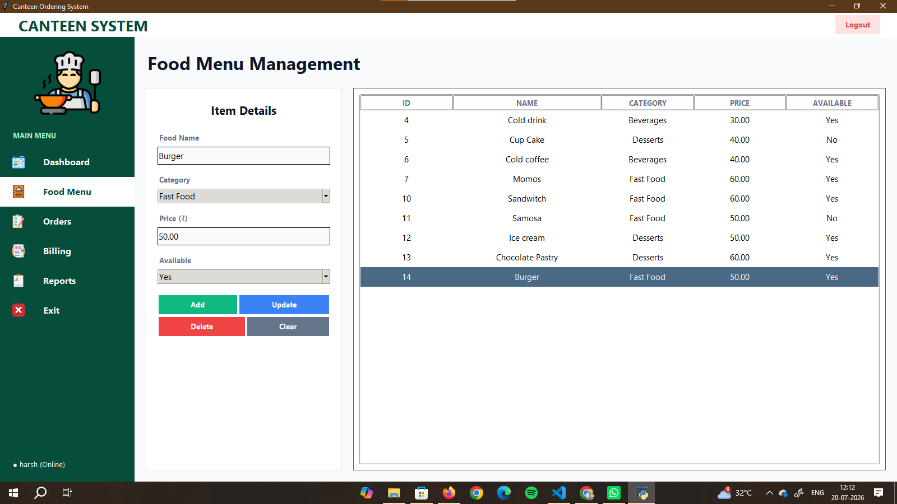
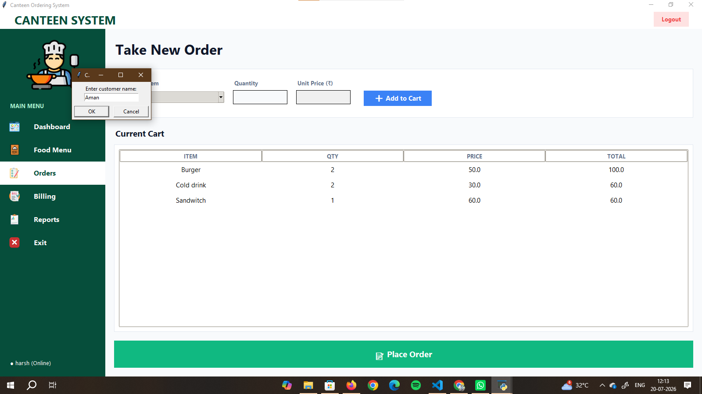
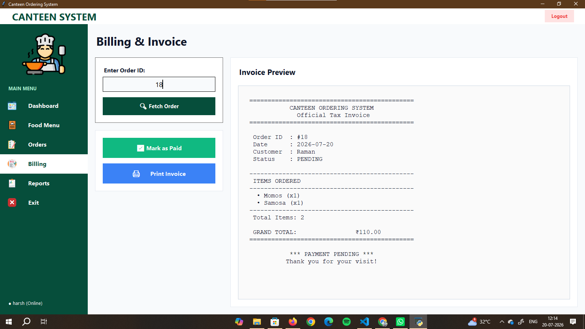
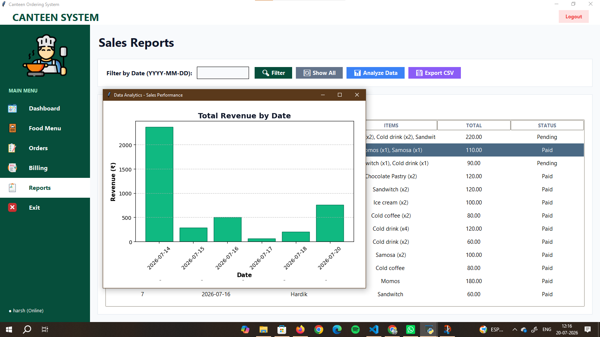

# Canteen Ordering System

This is a desktop application I built using Python and Tkinter to help manage day-to-day canteen operations. It handles taking orders, updating the menu, generating bills, and saving all the sales data securely in a local database.

## What it does
* **Dashboard:** Shows a quick summary of daily sales and total orders.
* **Menu Management:** You can easily add new food items or update prices.
* **Order & Billing:** Takes customer orders and generates a final bill.
* **Reports:** Keeps a history of past sales so you can track revenue.

## Tech Stack
* **Python 3**
* **Tkinter & PIL** (for the graphical interface)
* **MySQL** (Database)

## How to run this on your computer

1. **Download the code:** Clone this repository or download the folder.
2. **Set up the database:**
   * Make sure you have MySQL Server installed and running.
   * Open MySQL Workbench (or your preferred database manager).
   * Create a new database and name it exactly `canteen_db`.
   * Import the `canteen_db.sql` file located inside the `Project's_sqlpart` folder to set up the tables.
3. **Install required Python libraries:**
   Open your terminal in the project folder and run:
   ```text
   pip install pillow mysql-connector-python

   ## Application Screenshots

**1. Login Screen**


**2. Main Dashboard**


**3. Food Menu**


**4. Orders**


**5. Billing**


**6. Reports**
